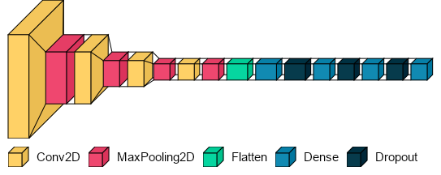

**ABOUT:**
A simple CNN model for image classification. This model was made as a personal project for food(Ikura Sushi, Mushroom and Onion) classification.

A simple image classification project with a small model and dataset.

The dataset used is in my [Kaggle Page](https://www.kaggle.com/bruhusernameistaken/5k-food-image-dataset).
